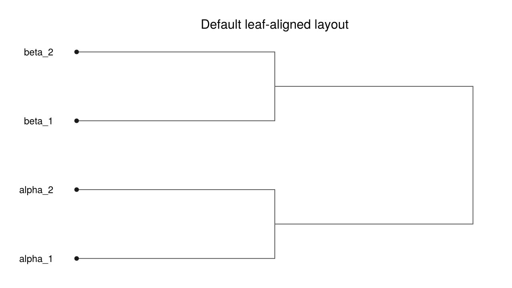
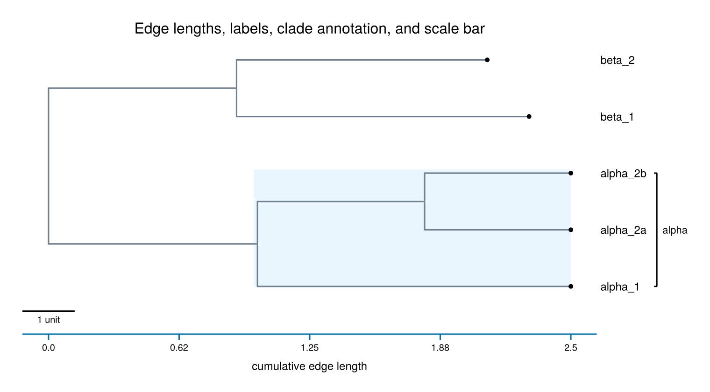

# LineagesMakie

[](https://jeetsukumaran.github.io/LineagesMakie.jl/stable/)
[](https://jeetsukumaran.github.io/LineagesMakie.jl/dev/)
[](https://github.com/jeetsukumaran/LineagesMakie.jl/actions/workflows/CI.yml?query=branch%3Amain)
[](https://github.com/JuliaTesting/Aqua.jl)

LineagesMakie.jl draws lineage graphs with Makie. In this package, a
lineage graph means a rooted branching history or hierarchy, such as a
phylogenetic tree, coalescent genealogy, cladogram, or any custom object graph
where each node can report its child nodes.

LineagesMakie.jl accepts ordinary Julia objects through a small accessor
interface, or any object that implements the AbstractTrees.jl `children`
interface. It does not require a package-specific tree type, an R bridge, or a
web service.

Use LineagesMakie.jl when you want Makie composition for rooted branching
structures: structure-only layouts, edge-length-proportional layouts, radial
layouts, labels, clade annotations, scale bars, `LineageAxis` decorations, and
Observable-backed updates.

Full reference documentation lives in the [stable docs](https://jeetsukumaran.github.io/LineagesMakie.jl/stable/)
and [development docs](https://jeetsukumaran.github.io/LineagesMakie.jl/dev/).
This README is a self-contained quick start and recipe guide.

## Installation

### General registry

After registration in the Julia General registry, the standard installation
command will be:

```julia
using Pkg
Pkg.add("LineagesMakie")
```

LineagesMakie.jl is not registered yet. Use the GitHub development version for
now.

### GitHub development version

```julia
using Pkg
Pkg.add(url = "https://github.com/jeetsukumaran/LineagesMakie.jl")
```

For local development from a checkout, activate this repository or the
`examples` project:

```julia
using Pkg
Pkg.develop(path = ".")
```

## Quick start

Start with a basenode and a function that returns each node's children. In the
example below, the code names the basenode `basenode` to follow package
identifier conventions. The package receives that object through
`lineageplot(basenode, accessor)` and
uses `children = node -> node.children` to traverse the graph.

This first example does not supply edge weights, so LineagesMakie.jl uses a
default layout that aligns the leaves.

The following example is available as
[`examples/readme_quickstart.jl`](examples/readme_quickstart.jl).

```julia
using CairoMakie
using LineagesMakie

struct Node
    name::String
    edgeweight::Float64
    children::Vector{Node}
end

leaf(name, edgeweight) = Node(name, edgeweight, Node[])
node(name, edgeweight, children::Node...) = Node(name, edgeweight, Node[children...])

basenode = node(
    "root",
    0.0,
    node("alpha", 0.0, leaf("alpha_1", 0.0), leaf("alpha_2", 0.0)),
    node("beta", 0.0, leaf("beta_1", 0.0), leaf("beta_2", 0.0)),
)

accessor = lineagegraph_accessor(basenode; children = node -> node.children)

plot_result = lineageplot(
    basenode,
    accessor;
    figure = (; size = (640, 360)),
    axis = (; title = "Default leaf-aligned layout"),
    leaf_label_func = node -> node.name,
    node_color = :white,
    node_strokecolor = :gray35,
    leaf_color = :gray10,
    edge_color = :gray35,
)

fig, lax, lp = plot_result
save("readme_quickstart.png", fig)
```



## Edge lengths and annotations

Add the `edgeweight(src, dst)` accessor when horizontal distance should reflect
edge weight. The same example also shows leaf labels, clade highlighting, a
clade bracket label, a quantitative x-axis, and a scale bar.

The full script is available as
[`examples/readme_features.jl`](examples/readme_features.jl).

```julia
using CairoMakie
using LineagesMakie

struct Node
    name::String
    edgeweight::Float64
    children::Vector{Node}
end

leaf(name, edgeweight) = Node(name, edgeweight, Node[])
node(name, edgeweight, children::Node...) = Node(name, edgeweight, Node[children...])

alpha = node(
    "alpha",
    1.0,
    leaf("alpha_1", 1.5),
    node("alpha_2", 0.8, leaf("alpha_2a", 0.7), leaf("alpha_2b", 0.7)),
)
beta = node("beta", 0.9, leaf("beta_1", 1.4), leaf("beta_2", 1.2))
basenode = node("root", 0.0, alpha, beta)

accessor = lineagegraph_accessor(
    basenode;
    children = node -> node.children,
    edgeweight = (src, dst) -> dst.edgeweight,
    nodevalue = node -> node.name,
)

plot_result = lineageplot(
    basenode,
    accessor;
    lineageunits = :edgeweights,
    figure = (; size = (760, 420)),
    axis = (;
        title = "Edge lengths, labels, clade annotation, and scale bar",
        show_x_axis = true,
        xlabel = "cumulative edge weight",
    ),
    edge_color = :slategray,
    edge_linewidth = 1.6,
    node_color = :white,
    node_strokecolor = :slategray,
    leaf_color = :black,
    leaf_label_func = node -> node.name,
    clade_nodes = [alpha],
    clade_label_func = node -> node.name,
    clade_highlight_color = (:lightskyblue, 0.25),
    scalebar_label = "1 unit",
    scalebar_auto_visible = true,
)

fig, lax, lp = plot_result
save("readme_features.png", fig)
```



## Input contract

LineagesMakie.jl uses `LineageGraphAccessor` as its input boundary. The
accessor stores callables that describe how to traverse and query your
lineage graph. The left column lists exact API names.

| Accessor | Required | Meaning |
|---|---:|---|
| `children(node)` | Yes | Return zero or more child nodes. A node with no children is a leaf. |
| `edgeweight(src, dst)` | No | Return the edge weight from source node `src` to destination node `dst`. |
| `nodevalue(node)` | No | Return a node value used by labels or mappings. |
| `branchingtime(node)` | No | Return a precomputed coordinate measured from the basenode. |
| `coalescenceage(node)` | No | Return a precomputed leaf-relative process coordinate. |
| `nodecoordinates(node)` | No | Return a user-supplied data-space `Point2f`. |
| `nodepos(node)` | No | Return a user-supplied pixel-space `Point2f`. |

Create an accessor from explicit callables:

```julia
accessor = lineagegraph_accessor(
    basenode;
    children = node -> node.children,
    edgeweight = (src, dst) -> dst.edgeweight,
    nodevalue = node -> node.name,
)
```

Use `abstracttrees_accessor` when your node type implements
`AbstractTrees.children`:

```julia
using AbstractTrees
using LineagesMakie

AbstractTrees.children(node::Node) = node.children

accessor = abstracttrees_accessor(
    basenode;
    edgeweight = (src, dst) -> dst.edgeweight,
    nodevalue = node -> node.name,
)
```

AbstractTrees.jl defines a fallback `children` method that returns `()` for
ordinary objects. If your type has no explicit `AbstractTrees.children` method,
`abstracttrees_accessor` treats the value as a single-leaf lineage graph.

## Plotting entry points

Use `lineageplot` when you want LineagesMakie.jl to create the `Figure` and
`LineageAxis`:

```julia
plot_result = lineageplot(basenode, accessor; axis = (; title = "Lineage plot"))
fig, lax, lp = plot_result
```

Use `lineageplot!` when you already own the plotting context:

```julia
fig = Figure()
lax = LineageAxis(fig[1, 1]; show_x_axis = true, xlabel = "edge weight")
lp = lineageplot!(lax, basenode, accessor; lineageunits = :edgeweights)
```

You can also target a standard Makie `Axis` when you do not need
`LineageAxis` decorations:

```julia
fig = Figure()
ax = Axis(fig[1, 1])
lp = lineageplot!(ax, basenode, accessor; leaf_label_func = node -> node.name)
```

The returned `lp` is a Makie plot object. Its derived attributes include:

```julia
geom = lp[:computed_geom][]
lineageunits = lp[:resolved_lineageunits][]
```

## Process coordinates and lineage units

The `lineageunits` keyword selects how LineagesMakie.jl computes the primary 
process coordinate of each node. If you omit `lineageunits`, the default is
`:edgeweights` when an edge weight accessor exists, and `:nodeheights`
otherwise.

| `lineageunits` | Required accessor | Process coordinate | Axis polarity |
|---|---|---|---|
| `:edgeweights` | `edgeweight` | Cumulative edge weight from the basenode. | `:forward` |
| `:branchingtime` | `branchingtime` | Precomputed coordinate measured from the basenode. | `:forward` |
| `:coalescenceage` | `coalescenceage` | Leaf-relative coordinate; leaves have value 0. | `:backward` |
| `:nodedepths` | None | Edge count from the basenode. | `:forward` |
| `:nodeheights` | None | Edge count to farthest descendant leaf; leaves have value 0. | `:backward` |
| `:nodelevels` | None | Integer level from the basenode. | `:forward` |
| `:nodecoordinates` | `nodecoordinates` | User-supplied data coordinates. | User-defined |
| `:nodepos` | `nodepos` | User-supplied pixel coordinates. | User-defined |

Use the layout functions directly when you need geometry before plotting:

```julia
geom = rectangular_layout(basenode, accessor; lineageunits = :edgeweights)
bb = boundingbox(geom)
leaf_order = geom.leaf_order
node_positions = geom.node_positions
```

## Orientation and polarity

The plotting contract has 4 related pieces:

- `lineageunits` chooses the process coordinate for each node.
- `axis_polarity` records whether the coordinate increases from the basenode
  toward the leaves or from the leaves toward the basenode.
- `display_polarity` controls whether increasing coordinates map to increasing
  screen position.
- `lineage_orientation` chooses which screen axis carries the process
  coordinate.

Supported `lineage_orientation` values are `:left_to_right`,
`:right_to_left`, `:bottom_to_top`, `:top_to_bottom`, and `:radial`.

```julia
fig = Figure()
lax = LineageAxis(
    fig[1, 1];
    lineage_orientation = :top_to_bottom,
    show_y_axis = true,
    show_grid = true,
    ylabel = "cumulative edge weight",
)
lineageplot!(lax, basenode, accessor; lineageunits = :edgeweights)
```

Use `display_polarity = :reversed` when the same process coordinates should
run in the opposite screen direction:

```julia
lax = LineageAxis(fig[1, 1]; display_polarity = :reversed)
lineageplot!(lax, basenode, accessor; lineageunits = :edgeweights)
```

Use `:radial` for circular layouts:

```julia
plot_result = lineageplot(
    basenode,
    accessor;
    axis = (; lineage_orientation = :radial, title = "Radial layout"),
    lineage_orientation = :radial,
    lineageunits = :edgeweights,
    leaf_label_func = node -> node.name,
)
```

## Styling and layers

The composite `LineagePlot` recipe forwards namespaced keyword arguments to
its layers.

| Layer | Common keywords |
|---|---|
| Edges | `edge_color`, `edge_linewidth`, `edge_linestyle`, `edge_alpha`, `edge_visible`. |
| Internal nodes | `node_marker`, `node_color`, `node_markersize`, `node_strokecolor`, `node_visible`. |
| Leaves | `leaf_marker`, `leaf_color`, `leaf_markersize`, `leaf_strokecolor`, `leaf_visible`. |
| Leaf labels | `leaf_label_func`, `leaf_label_fontsize`, `leaf_label_color`, `leaf_label_italic`, `leaf_label_visible`. |
| Node labels | `node_label_func`, `node_label_threshold`, `node_label_position`, `node_label_fontsize`. |
| Clade highlights | `clade_nodes`, `clade_highlight_color`, `clade_highlight_alpha`, `clade_highlight_padding`. |
| Clade labels | `clade_nodes`, `clade_label_func`, `clade_label_color`, `clade_label_fontsize`, `clade_label_side`. |
| Scale bars | `scalebar_label`, `scalebar_length`, `scalebar_position`, `scalebar_auto_visible`. |

`edge_color` may be a uniform color or a function of `(src, dst)`:

```julia
lineageplot!(
    lax,
    basenode,
    accessor;
    edge_color = (src, dst) -> dst.edgeweight > 1.0 ? :tomato : :gray50,
    leaf_label_func = node -> node.name,
)
```

Node labels are opt-in. Enable them with `node_label_threshold`:

```julia
lineageplot!(
    lax,
    basenode,
    accessor;
    node_label_func = node -> node.name,
    node_label_threshold = node -> !isempty(node.children),
    node_label_position = :toward_parent,
)
```

## Manual layer composition

Use lower-level layout and layer recipes when you want to compose the plot
yourself.

```julia
geom = rectangular_layout(basenode, accessor; lineageunits = :edgeweights)

fig = Figure()
ax = Axis(fig[1, 1])
hidedecorations!(ax)
hidespines!(ax)

edgelayer!(ax, geom; color = :gray40, linewidth = 1.5)
nodelayer!(ax, geom, accessor; color = :white, strokecolor = :gray40)
leaflayer!(ax, geom, accessor; color = :black)
leaflabellayer!(ax, geom, accessor; text_func = node -> node.name)
```

Manual layer composition uses public layer functions. Prefer `lineageplot` or
`lineageplot!` unless you need direct layer control.

## Observable updates

The basenode and plot attributes can be Observables. This follows standard Makie
reactivity.

```julia
basenode_observable = Observable(basenode)

plot_result = lineageplot(
    basenode_observable,
    accessor;
    lineageunits = :edgeweights,
    leaf_label_func = node -> node.name,
)

fig, lax, lp = plot_result

lp.edge_color = :steelblue
basenode_observable[] = another_basenode
```

Use the same accessor contract for every basenode value assigned to the
Observable.

## Examples

The `examples` project contains runnable scripts:

- [`examples/readme_quickstart.jl`](examples/readme_quickstart.jl) generates the first README image.
- [`examples/readme_features.jl`](examples/readme_features.jl) generates the annotated README image.
- [`examples/lineageplot_ex1.jl`](examples/lineageplot_ex1.jl) is a compact starter example.
- [`examples/lineageplot_ex2.jl`](examples/lineageplot_ex2.jl) is a denser multi-panel feature smoke example.

Run an example from the repository root:

```sh
julia --project=examples examples/readme_quickstart.jl
```

## Development checks

The package uses separate projects for tests, examples, and documentation.

```sh
julia --project=test test/runtests.jl
julia --project=examples examples/readme_quickstart.jl
julia --project=examples examples/readme_features.jl
julia --project=docs docs/make.jl
```

## Planned capacities

See [`ROADMAP.md`](ROADMAP.md) for planned capacities. The roadmap separates
future work from the current public API.

## License

LineagesMakie.jl is distributed under the license in [`LICENSE.md`](LICENSE.md).
